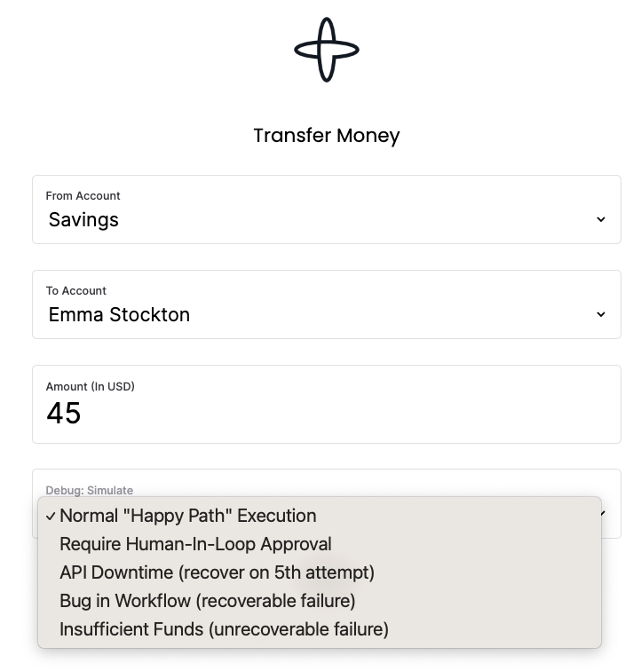

# Money Transfer Example

Demos various aspects of [Temporal](https://temporal.io) using the Java SDK.

A [Typescript SDK version](https://github.com/steveandroulakis/temporal-money-transfer) of this example is also available.



## Configuration

The sample is configured by default to connect to a [local Temporal Server](https://docs.temporal.io/cli#starting-the-temporal-server) running on localhost:7233.

To instead connect to Temporal Cloud, set the following environment variables, replacing them with your own Temporal Cloud credentials:

```bash
TEMPORAL_ADDRESS=testnamespace.sdvdw.tmprl.cloud:7233
TEMPORAL_NAMESPACE=testnamespace.sdvdw
TEMPORAL_CERT_PATH="/path/to/file.pem"
TEMPORAL_KEY_PATH="/path/to/file.key"
````

(optional) set a task queue name
```bash
export TEMPORAL_MONEYTRANSFER_TASKQUEUE="MoneyTransferJava"
```

## Run a Workflow

Note: Use a Java 18 SDK.

Start a worker:

```bash
ENCRYPT_PAYLOADS=true ./gradlew -q execute -PmainClass=io.temporal.samples.moneytransfer.AccountTransferWorker --console=plain
```

Run the money transfer web UI:

```bash
ENCRYPT_PAYLOADS=true ./gradlew -q execute -PmainClass=io.temporal.samples.moneytransfer.web.WebServer --console=plain
```
Then navigate to `http://localhost:7070/`

## Demo various failures and recoveries

A dropdown menu simulates the following scenarios

#### Happy Path
- The transfer will run to completion

#### Advanced Visibility
The transfer will in addition to running to completion, upsert a search attribute called Step. The Step search attribute defines what part of the workflow is being executed: withdraw or deposit. By upserting a search attribute we are able to search workflows by not only execution status, time, duration but also, based on business logic exposed by the search attribute.

In order to demonstrate this feature the [search attribute](https://docs.temporal.io/visibility#search-attribute) ```Step``` which is a ```Keyword``` must be created in the Temporal namespace. This can be accomplished using the UI or CLI.

#### Require Human-In-Loop Approval
The transfer will pause and wait for approval. If the user doesn't approve the transfer within a set time, the workflow will fail.

Approve a transfer using **Signals**
```bash
# where TRANSFER-EZF-249 is the workflowId
./gradlew -q execute -PmainClass=io.temporal.samples.moneytransfer.TransferApprover -Parg=TRANSFER-XXX-XXX
````

You can also do this through the `temporal` cli:
```bash
temporal workflow signal \
 --env prod \
 --query 'WorkflowId="TRANSFER-XXX-XXX"' \
 --name approveTransfer \
 --reason 'approving transfer'
```

Approve a transfer using **Updates**

You can do this through the `temporal` cli:
```bash
temporal workflow update \
 --env prod \
 --workflow-id TRANSFER-XXX-XXX \
 --name approveTransferUpdate
```

The workflow's Update function has a [validator](https://docs.temporal.io/dev-guide/java/features#validate-an-update). It will reject an Update if:
- The transfer isn't waiting for approval
- The transfer has already been approved

#### Simulate a Bug in the Workflow (recoverable failure)
Comment out the RuntimeException in the workflow code (`AccountTransferWorkflowImpl.java`) and restart the worker to fix the 'bug'.

#### Simulate API Downtime (recover on 5th attempt)
Will introduce artifical delays in the `withdraw` activity's API calls. This will cause activity retries. After 5 retries, the delay will be removed and the workflow will proceed.

#### Invalid Account (unrecoverable failure)
Introduces an unrecoverable failure in the `deposit` activity (invalid account). The workflow will fail after running compensation activities (`undoWithdraw`).

#### Schedule a recurring transfer
Creates a [Schedule](https://docs.temporal.io/workflows#schedule) that will run a set of workflows on a cadence.

Produces a schedule ID, which you can inspect in the Temporal UI's "Schedules" menu.

## Advanced: Reset workflows

#### List failed workflows
temporal workflow list --env prod -q 'ExecutionStatus="Failed" OR ExecutionStatus="Terminated"'

## Enable Encryption

Remove the `ENCRYPT_PAYLOADS` variable in each command to run without encryption.

You can decrypt these payloads in Temporal Cloud's UI/cli using the codec server: `https://codec.tmprl-demo.cloud` ([source](https://github.com/steveandroulakis/temporal-codec-server)). Ensure you switch on "Pass the user access token with your endpoint". Note: The codec server is only compatible with workflows running in Temporal Cloud.

## Test for non-determinism errors (Replay)

### Replaying the most recently run workflow executions

When step-debugging, ensure environment variable `TEMPORAL_DEBUG=true` is set, to avoid deadlock detection.

Example command (run from root directory)
```bash
./gradlew -q execute -PmainClass=io.temporal.samples.moneytransfer.RecentHistoryReplayer
```

Introduce a non-determinism error by adding Workflow.Sleep or re-arranging activity executions:
```bash
 error=io.temporal.worker.NonDeterministicException:
  Failure handling event 15 of type 'EVENT_TYPE_ACTIVITY_TASK_SCHEDULED' during replay.
  No command scheduled that corresponds to event_id: 15
  
  # Note: This replayer doesn't work with histories using ENCRYPT_PAYLOADS=true
```

### Using a test workflow history

Example command (run from root directory)
```bash
./gradlew -q execute -PmainClass=io.temporal.samples.moneytransfer.Replayer \
 -Parg=../workflowHistories/non-deterministic.json # or happy-path.json
```

---

## Where is the UI code?

_The organization of UI code is 'less than perfect'. It's a todo list item for the future to refactor it._

* The UI code is based on the [SvelteKit](https://kit.svelte.dev/) framework.
* It lives in the [Typescript version of the Money Transfer example](https://github.com/steveandroulakis/temporal-money-transfer) under `./ui`.
* A compiled version was built and copied to this Java example repository 
* To modify and test the UI:
  * Deploy the Typescript version of the Money Transfer example
  * Modify the UI code in the Typescript version
  * Run and test that version, it will build the UI
  * If the UI works in the Typescript version, it will work in the Java one
* Deploy a new version of the UI into the Java example
    * Remove the existing UI directory: `temporal-money-transfer-java/core/src/main/resources/svelte_ui/build`
    * Copy the UI from the Typescript example to the Java example:
```bash
cp -r /path/to/temporal-money-transfer/server/build \
      /path/to/temporal-money-transfer-java/core/src/main/resources/svelte_ui
```
